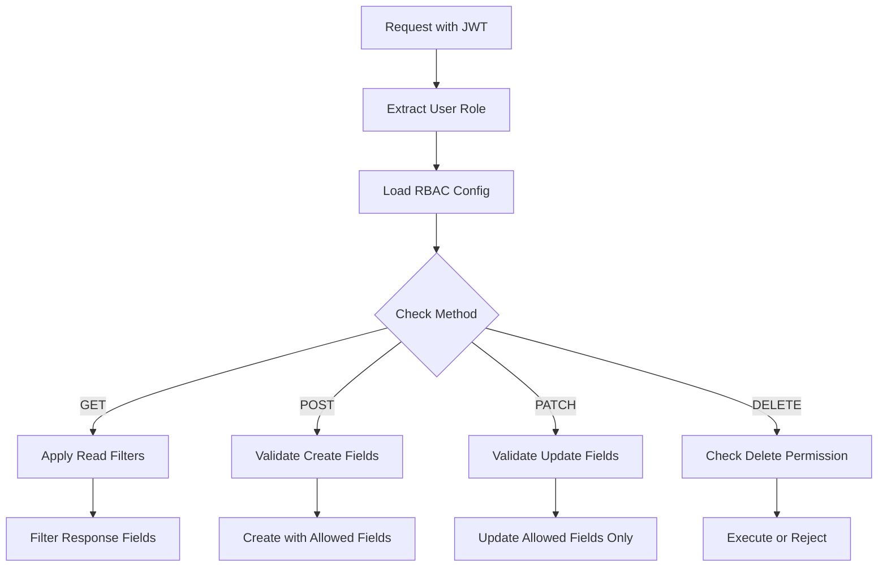

# RBAC Configuration Chi Tiết

## Giới thiệu

Role-Based Access Control (RBAC) trong MongoREST cung cấp hệ thống phân quyền linh hoạt ở cấp độ field, cho phép kiểm soát chính xác những gì mỗi role có thể xem, tạo, sửa và xóa.

## Cấu trúc RBAC Configuration

### 1. Schema-level RBAC

```json
{
  "collection_name": "orders",
  "rbac_config": {
    "GET": [
      {
        "user_role": "guest",
        "patterns": [
          {"_id": {"type": "string"}},
          {"orderNumber": {"type": "string"}},
          {"status": {"type": "string", "enum": ["pending", "processing", "completed"]}}
        ]
      },
      {
        "user_role": "user",
        "patterns": [
          {"_id": {"type": "string"}},
          {"orderNumber": {"type": "string"}},
          {"status": {"type": "string"}},
          {"totalAmount": {"type": "number"}},
          {"items": {"type": "array"}},
          {"customer": {
            "type": "relation",
            "relate_collection": "users",
            "fields": ["name", "email"]
          }}
        ]
      },
      {
        "user_role": "admin",
        "patterns": [] // Empty array = full access
      }
    ],
    "POST": [
      {
        "user_role": "user",
        "patterns": [
          {"customerId": {
            "type": "string",
            "pattern": "^[a-zA-Z0-9]{24}$",
            "required": true
          }},
          {"items": {
            "type": "array",
            "minItems": 1,
            "items": {
              "type": "object",
              "properties": {
                "productId": {"type": "string", "required": true},
                "quantity": {"type": "integer", "minimum": 1}
              }
            }
          }},
          {"shippingAddress": {
            "type": "object",
            "required": ["street", "city", "postalCode", "country"],
            "properties": {
              "street": {"type": "string", "maxLength": 200},
              "city": {"type": "string", "maxLength": 100},
              "postalCode": {"type": "string", "pattern": "^[0-9]{5,10}$"},
              "country": {"type": "string", "enum": ["VN", "US", "UK", "FR"]}
            }
          }}
        ]
      },
      {
        "user_role": "admin",
        "patterns": []
      }
    ],
    "PATCH": [
      {
        "user_role": "user",
        "patterns": [
          {"shippingAddress": {"type": "object"}},
          {"notes": {"type": "string", "maxLength": 500}}
        ]
      },
      {
        "user_role": "admin",
        "patterns": []
      }
    ],
    "DELETE": [
      {
        "user_role": "admin"
      }
    ]
  }
}
```

### 2. Default Roles

MongoREST cung cấp 4 role mặc định:

#### Guest Role
```json
{
  "role": "guest",
  "description": "Anonymous users",
  "permissions": {
    "default": {
      "read": ["public_fields"],
      "create": false,
      "update": false,
      "delete": false
    }
  }
}
```

#### User Role
```json
{
  "role": "user",
  "description": "Authenticated users",
  "permissions": {
    "default": {
      "read": ["standard_fields"],
      "create": ["owned_resources"],
      "update": ["owned_resources"],
      "delete": false
    }
  }
}
```

#### Developer Role
```json
{
  "role": "developer",
  "description": "Development team",
  "permissions": {
    "default": {
      "read": ["all_except_sensitive"],
      "create": true,
      "update": true,
      "delete": ["test_data"]
    }
  }
}
```

#### Admin Role
```json
{
  "role": "admin",
  "description": "Full system access",
  "permissions": {
    "default": {
      "read": true,
      "create": true,
      "update": true,
      "delete": true
    }
  }
}
```

## Field-level Permissions

### 1. Basic Field Configuration

```json
{
  "user_role": "user",
  "patterns": [
    {
      "fieldName": {
        "type": "string",              // Data type
        "read": true,                   // Can read
        "write": false,                 // Can write
        "required": false,              // Required for creation
        "maxLength": 100,              // Validation rules
        "pattern": "^[A-Za-z0-9]+$"    // Regex pattern
      }
    }
  ]
}
```

### 2. Nested Object Permissions

```json
{
  "profile": {
    "type": "object",
    "properties": {
      "public": {
        "type": "object",
        "read": ["guest", "user", "admin"],
        "write": ["user", "admin"],
        "properties": {
          "displayName": {"type": "string"},
          "avatar": {"type": "string", "format": "uri"}
        }
      },
      "private": {
        "type": "object",
        "read": ["user", "admin"],
        "write": ["user", "admin"],
        "properties": {
          "email": {"type": "string", "format": "email"},
          "phone": {"type": "string"}
        }
      },
      "sensitive": {
        "type": "object",
        "read": ["admin"],
        "write": ["admin"],
        "properties": {
          "ssn": {"type": "string"},
          "creditCard": {"type": "string"}
        }
      }
    }
  }
}
```

### 3. Array Field Permissions

```json
{
  "orders": {
    "type": "array",
    "read": ["user", "admin"],
    "write": false,
    "items": {
      "type": "object",
      "properties": {
        "orderId": {
          "type": "string",
          "read": true
        },
        "amount": {
          "type": "number",
          "read": ["user", "admin"],
          "write": false
        },
        "internalNotes": {
          "type": "string",
          "read": ["admin"],
          "write": ["admin"]
        }
      }
    }
  }
}
```

## Relationship Permissions

### 1. Basic Relationship Access

```json
{
  "customer": {
    "type": "relation",
    "relate_collection": "users",
    "read": ["user", "admin"],
    "fields": {
      "public": ["name", "avatar"],
      "private": {
        "fields": ["email", "phone"],
        "roles": ["admin"]
      }
    }
  }
}
```

### 2. Conditional Relationship Access

```json
{
  "orders": {
    "type": "relation",
    "relate_collection": "orders",
    "read": {
      "condition": "owner_match",
      "field": "customerId",
      "operator": "equals",
      "value": "{{user.id}}"
    },
    "fields": ["orderNumber", "totalAmount", "status"]
  }
}
```

## Dynamic Permission Rules

### 1. Ownership-based Access

```javascript
// rbac-rules/ownership.js
module.exports = {
  name: "ownership",
  description: "Allow access to owned resources",
  
  evaluate: (user, document, operation) => {
    switch (operation) {
      case 'read':
      case 'update':
        return document.ownerId === user.id || 
               document.createdBy === user.id;
      
      case 'delete':
        return document.ownerId === user.id && 
               user.permissions.includes('delete_own');
      
      default:
        return false;
    }
  }
};
```

### 2. Time-based Access

```javascript
// rbac-rules/timeAccess.js
module.exports = {
  name: "timeAccess",
  description: "Restrict access based on time",
  
  evaluate: (user, document, operation) => {
    const now = new Date();
    const businessHours = {
      start: 9,  // 9 AM
      end: 18    // 6 PM
    };
    
    const currentHour = now.getHours();
    
    // Admin can access anytime
    if (user.role === 'admin') return true;
    
    // Others only during business hours
    return currentHour >= businessHours.start && 
           currentHour < businessHours.end;
  }
};
```

### 3. Quota-based Access

```javascript
// rbac-rules/quota.js
module.exports = {
  name: "quota",
  description: "Enforce usage quotas",
  
  evaluate: async (user, document, operation) => {
    if (operation !== 'create') return true;
    
    const monthlyQuota = {
      'guest': 10,
      'user': 100,
      'developer': 1000,
      'admin': Infinity
    };
    
    const currentMonth = new Date().toISOString().slice(0, 7);
    const usage = await db.collection('usage_stats').countDocuments({
      userId: user.id,
      month: currentMonth,
      operation: 'create'
    });
    
    return usage < monthlyQuota[user.role];
  }
};
```

## Collection-specific Configurations

### 1. Products Collection

```json
{
  "collection_name": "products",
  "rbac_config": {
    "GET": [
      {
        "user_role": "guest",
        "patterns": [
          {"name": {"type": "string"}},
          {"price": {"type": "number"}},
          {"description": {"type": "string"}},
          {"images": {"type": "array"}}
        ]
      },
      {
        "user_role": "user",
        "patterns": [
          // Inherits guest fields plus:
          {"stock": {"type": "integer"}},
          {"categories": {"type": "relation"}},
          {"reviews": {"type": "relation"}}
        ]
      },
      {
        "user_role": "admin",
        "patterns": [] // Full access including cost, supplier, etc.
      }
    ]
  }
}
```

### 2. Users Collection

```json
{
  "collection_name": "users",
  "rbac_config": {
    "GET": [
      {
        "user_role": "user",
        "patterns": [
          {
            "_id": {
              "type": "string",
              "condition": "self_only" // Can only read own ID
            }
          },
          {"profile.public": {"type": "object"}},
          {
            "profile.private": {
              "type": "object",
              "condition": "self_only"
            }
          }
        ]
      }
    ],
    "PATCH": [
      {
        "user_role": "user",
        "patterns": [
          {
            "profile": {
              "type": "object",
              "condition": "self_only"
            }
          },
          {
            "password": {
              "type": "string",
              "condition": "self_only",
              "validation": "password_strength"
            }
          }
        ]
      }
    ]
  }
}
```

## Processing Pipeline

### 1. Request Flow



### 2. Field Filtering Algorithm

```javascript
function filterFieldsByRole(data, rolePatterns) {
  const filtered = {};
  
  for (const pattern of rolePatterns) {
    for (const [field, config] of Object.entries(pattern)) {
      if (data.hasOwnProperty(field)) {
        // Check if field access is allowed
        if (config.read === true || 
            (Array.isArray(config.read) && config.read.includes(userRole))) {
          
          // Apply nested filtering for objects
          if (config.type === 'object' && config.properties) {
            filtered[field] = filterFieldsByRole(
              data[field], 
              [config.properties]
            );
          } else {
            filtered[field] = data[field];
          }
        }
      }
    }
  }
  
  return filtered;
}
```

## Best Practices

### 1. Principle of Least Privilege

```json
// Bad: Too permissive
{
  "user_role": "user",
  "patterns": []  // Full access
}

// Good: Specific permissions
{
  "user_role": "user",
  "patterns": [
    {"name": {"type": "string", "read": true}},
    {"email": {"type": "string", "read": true, "write": "self_only"}}
  ]
}
```

### 2. Sensitive Data Protection

```json
{
  "payment": {
    "type": "object",
    "properties": {
      "method": {
        "type": "string",
        "read": ["user", "admin"]
      },
      "last4": {
        "type": "string",
        "read": ["user", "admin"]
      },
      "fullNumber": {
        "type": "string",
        "read": false,  // Never expose
        "write": ["payment_processor"]
      }
    }
  }
}
```

### 3. Audit Trail

```json
{
  "audit": {
    "type": "object",
    "read": ["admin", "auditor"],
    "write": false,  // System-managed only
    "properties": {
      "createdBy": {"type": "string"},
      "createdAt": {"type": "string", "format": "date-time"},
      "modifiedBy": {"type": "string"},
      "modifiedAt": {"type": "string", "format": "date-time"},
      "changes": {"type": "array"}
    }
  }
}
```

## Testing RBAC

### 1. Unit Tests

```javascript
describe('RBAC Configuration', () => {
  it('should filter fields for guest role', async () => {
    const document = {
      _id: '123',
      name: 'Product',
      price: 100,
      cost: 50,  // Should be filtered
      supplier: 'ABC Corp'  // Should be filtered
    };
    
    const filtered = applyRBACFilter(document, 'guest', 'products');
    
    expect(filtered).toEqual({
      _id: '123',
      name: 'Product',
      price: 100
    });
  });
});
```

### 2. Integration Tests

```javascript
describe('RBAC API Tests', () => {
  it('should return different fields based on role', async () => {
    // Test as guest
    const guestResponse = await request(app)
      .get('/crud/products/123')
      .set('Authorization', `Bearer ${guestToken}`);
    
    expect(guestResponse.body.data).not.toHaveProperty('cost');
    
    // Test as admin
    const adminResponse = await request(app)
      .get('/crud/products/123')
      .set('Authorization', `Bearer ${adminToken}`);
    
    expect(adminResponse.body.data).toHaveProperty('cost');
  });
});
```

## Monitoring & Debugging

### 1. RBAC Debug Mode

```javascript
// Enable debug mode
process.env.RBAC_DEBUG = 'true';

// Debug output
{
  "rbac_debug": {
    "user_role": "user",
    "collection": "orders",
    "method": "GET",
    "allowed_fields": ["_id", "orderNumber", "status"],
    "denied_fields": ["internalNotes", "profit"],
    "applied_rules": ["default", "ownership"]
  }
}
```

### 2. Access Logs

```javascript
// Log access attempts
logger.info('RBAC Access', {
  userId: user.id,
  role: user.role,
  collection: 'orders',
  method: 'GET',
  fieldsRequested: Object.keys(requestedFields),
  fieldsGranted: Object.keys(grantedFields),
  fieldsDenied: Object.keys(deniedFields)
});
```

## Next Steps

- Tìm hiểu về [Field-level Security](./field-level-security.md)
- Xem [Security Best Practices](./best-practices.md)
- Đọc [Authentication](./authentication.md) để hiểu về JWT integration