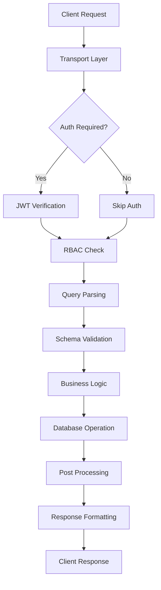

# Data Flow và Processing Pipeline

Trang này mô tả chi tiết cách data flows qua MongoREST system, từ request đến response.

## Request Lifecycle Overview



## Special Processing Flows

### 1. Dry Run Mode

```javascript
// Dry run execution
if (query.special.dryRun) {
  return {
    success: true,
    dryRun: true,
    data: null,
    debug: {
      parsedQuery: query,
      pipeline: pipeline,
      estimatedCost: estimateQueryCost(pipeline)
    }
  }
}
```

### 2. Debug Mode

```javascript
// Debug information
if (query.special.debug) {
  response.debug = {
    query: originalQuery,
    parsed: parsedQuery,
    pipeline: generatedPipeline,
    executionTime: endTime - startTime,
    indexesUsed: getIndexesUsed(explainResult),
    rbacApplied: {
      role: user.role,
      hiddenFields: hiddenFields
    }
  }
}
```

## Error Handling Flow

```javascript
// Error handling middleware
async function errorHandler(error, request, reply) {
  // Log error
  logger.error({
    error: error.message,
    stack: error.stack,
    request: {
      method: request.method,
      url: request.url,
      user: request.user?.id
    }
  })
  
  // Determine status code
  const statusCode = error.statusCode || 500
  
  // Format error response
  const response = {
    success: false,
    error: error.name,
    message: error.message,
    code: error.code
  }
  
  // Add details in development
  if (NODE_ENV === 'development') {
    response.stack = error.stack
    response.details = error.details
  }
  
  // Send response
  reply.status(statusCode).send(response)
}
```

## Summary

Data flow trong MongoREST được thiết kế để:

1. **Secure**: Multi-layer security checks
2. **Efficient**: Optimized pipeline generation
3. **Flexible**: Extensible qua plugins
4. **Observable**: Comprehensive monitoring
5. **Cacheable**: Strategic caching points

Hiểu rõ data flow giúp:
- 🔍 Debug issues nhanh chóng
- ⚡ Optimize performance bottlenecks
- 🔒 Ensure security at every step
- 🛠️ Extend functionality đúng cách

Next: [Features Documentation →](/docs/features/plugin-system)
