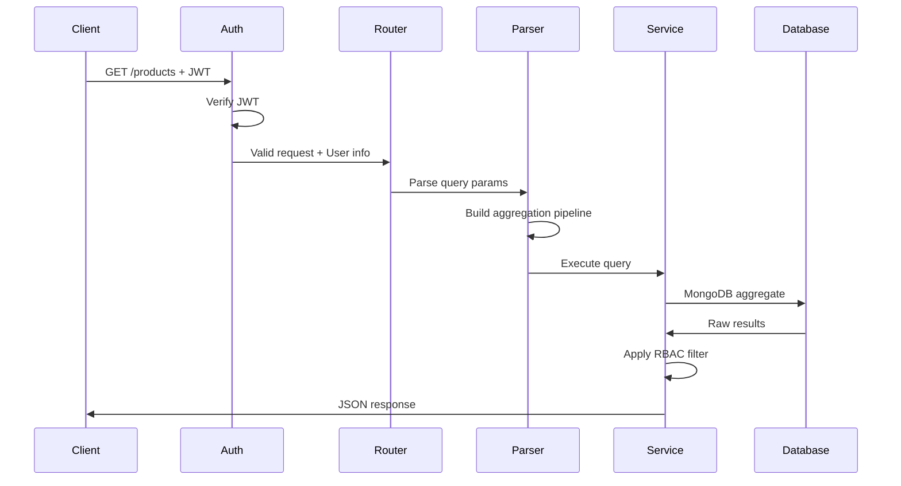

# Kiến Trúc Tổng Thể

MongoREST được thiết kế theo kiến trúc modular, dễ mở rộng và maintain. Trang này giải thích overall architecture và cách các components tương tác.

## Architecture Overview

```
┌─────────────────────┐
│   Client Request    │
└─────────┬───────────┘
          │
┌─────────▼───────────┐
│  JWT Authentication │ ← Xác thực token, extract user info
└─────────┬───────────┘
          │
┌─────────▼───────────┐
│   Request Router    │ ← Phân loại request (CRUD/Function)
│  /crud/* /funcs/*   │
└─────────┬───────────┘
          │
┌─────────▼───────────┐
│   RBAC Middleware   │ ← Kiểm tra quyền truy cập
└─────────┬───────────┘
          │
┌─────────▼───────────┐
│ Relationship Parser │ ← Parse relationship queries
│  & Filter Handler   │
└─────────┬───────────┘
          │
┌─────────▼───────────┐
│ MongoDB Aggregation │ ← Build và execute pipelines
│    & Operations     │
└─────────┬───────────┘
          │
┌─────────▼───────────┐
│   JSON Response     │ ← Format response, add metadata
└─────────────────────┘
```

## Layers Architecture

### 1. Transport Layer

**Responsibility**: Handle HTTP requests/responses

```javascript
// Fastify routes
app.get('/crud/:collection', handlers.list)
app.post('/crud/:collection', handlers.create)
app.patch('/crud/:collection/:id', handlers.update)
app.delete('/crud/:collection/:id', handlers.delete)
```

**Components**:
- **Route Handlers**: Map URLs to business logic
- **Middleware Pipeline**: Auth, RBAC, validation
- **Response Formatter**: Consistent JSON structure

### 2. Security Layer

**Responsibility**: Authorization

```javascript
// RBAC check
const allowed = hasAccess(collection, operation, user.role)
```

**Components**:
- **RBAC Engine**: Role-based permissions
- **Field Filter**: Hide fields based on role

### 3. Business Logic Layer

**Responsibility**: Core application logic

```javascript
// Schema validation
const valid = validator.validate(data, schema)

// Relationship resolution
const pipeline = buildRelationshipPipeline(query)
```

**Components**:
- **Schema Loader**: Load và cache schemas
- **CRUD Service**: Generic CRUD operations
- **Query Parser**: Parse query parameters
- **Relationship Resolver**: Handle joins

### 4. Data Access Layer

**Responsibility**: Database interactions

```javascript
// MongoDB operations
const result = await db.collection(name).aggregate(pipeline)
```

**Components**:
- **MongoDB Client**: Connection management
- **Query Builder**: Build MongoDB queries

## Component Interactions

### Request Flow Example

Ví dụ với request: `GET /products?select=name,category()&price=gte.100`



## Performance Architecture

### Async Processing

```javascript
// Non-blocking operations
async function handleRequest(req, res) {
  const promises = [
    validateInput(req.body),
    checkPermissions(req.user),
    loadRelatedData(req.params)
  ]
  
  const [valid, allowed, related] = await Promise.all(promises)
}
```

## Next Steps

Hiểu kiến trúc tổng thể giúp bạn:
- 🏗️ Extend MongoREST cho needs riêng
- 🔍 Debug issues hiệu quả
- ⚡ Optimize performance
- 🔒 Implement security best practices

Tiếp theo: [Core Components →](./core-components)
