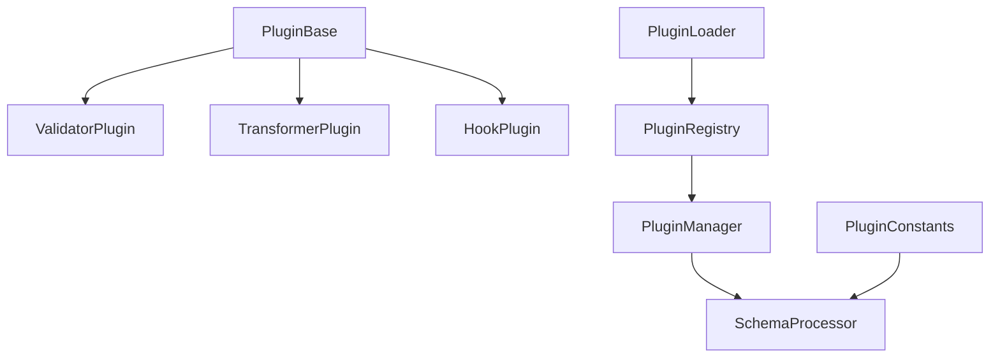

# Plugin System Overview

MongoREST Plugin System là một kiến trúc mở rộng cho phép thêm các chức năng tùy chỉnh vào hệ thống mà không cần sửa đổi core code.

## Kiến trúc Plugin

### Core Components



### Component Descriptions

| Component | Chức năng |
|-----------|-----------|
| **PluginBase** | Abstract base class cho tất cả plugins |
| **PluginRegistry** | Singleton registry quản lý plugin instances |
| **PluginManager** | Execute plugins và handle chains |
| **PluginLoader** | Load và register plugins |
| **SchemaProcessor** | Process schema với field plugins |
| **PluginConstants** | Quản lý danh sách field plugin names |

## Plugin Types

### 1. Validator Plugins
Validate dữ liệu theo các quy tắc cụ thể:

```typescript
export abstract class ValidatorPlugin extends PluginBase {
    public abstract validate(data: any, context?: any): boolean;
}
```

### 2. Transformer Plugins
Transform hoặc enrich dữ liệu:

```typescript
export abstract class TransformerPlugin extends PluginBase {
    public abstract transform(data: any, context?: any): any;
}
```

### 3. Hook Plugins
Execute logic tại các lifecycle events:

```typescript
export abstract class HookPlugin extends PluginBase {
    public abstract run(data: any, context?: any): any;
}
```

## Built-in Plugins

### Field Generation Plugins

| Plugin | Field Added | Description |
|--------|-------------|-------------|
| `createdAt` | createdAt | ISO timestamp khi tạo |
| `updatedAt` | updatedAt | ISO timestamp khi update |
| `timestamp` | createdAt, updatedAt | Cả hai timestamps |
| `uuid` | uuid | UUID v4 identifier |
| `version` | version | Version number |
| `slug` | slug | URL-friendly slug |

## Schema Integration

### Field Plugin Syntax

```json
{
  "collection": "users",
  "properties": {
    "name": { "type": "string" },
    "email": { "type": "string" }
  },
  
  // Field plugins
  "createdAt": true,
  "updatedAt": true,
  "uuid": true
}
```

### Hook Configuration

```json
{
  "mongorest:hooks": {
    "beforeCreate": ["timestamp"],
    "beforeUpdate": ["updatedAt"],
    "afterCreate": ["notifyWebhook"]
  }
}
```

## Plugin Workflow

### 1. Initialization Flow

```
Application Start
    ↓
setupPlugins()
    ↓
PluginLoader.loadBuiltInPlugins()
    ↓
Register to PluginRegistry
    ↓
Update PluginConstants
    ↓
Return { pluginManager, schemaProcessor }
```

### 2. Execution Flow

```
Schema Processing
    ↓
Extract Field Plugins
    ↓
For each plugin:
    ↓
PluginManager.executePlugin()
    ↓
Plugin.execute()
    ↓
Return transformed data
```

## Performance Considerations

1. **In-memory Registry**: Tất cả plugins được load vào memory khi startup
2. **Singleton Pattern**: PluginRegistry sử dụng singleton để tránh duplicate instances
3. **Lazy Loading**: Custom plugins có thể được load on-demand
4. **Pipeline Optimization**: Sequential execution với data passing

## Security

1. **Plugin Isolation**: Mỗi plugin chạy độc lập
2. **Context Validation**: Context data được validate trước khi pass vào plugins
3. **Error Handling**: Plugin errors không crash system
4. **Type Safety**: Full TypeScript support

## Next Steps

- [Support Plugin](./support-plugin) - Chi tiết về plugin architecture
- [Validate Syntax](./validate-syntax) - Syntax validation system
- [Custom Validate Syntax](./custom-validate-syntax) - Custom validation rules
- [Custom Plugin](./custom-plugin) - Tạo custom plugins
