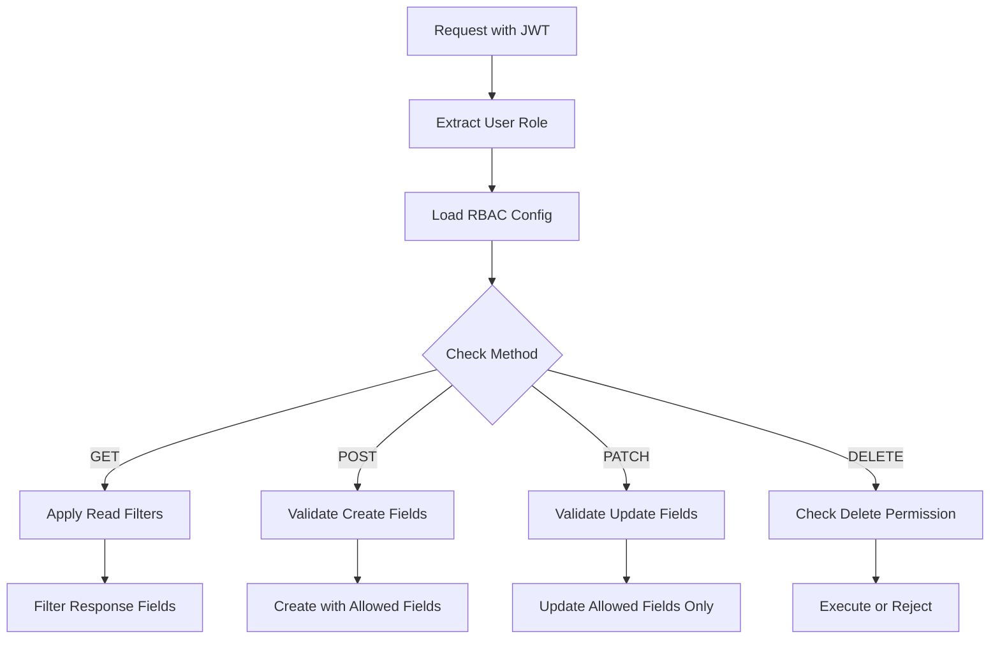

# RBAC Configuration Chi Tiết

## Giới thiệu

Role-Based Access Control (RBAC) trong MongoREST cung cấp hệ thống phân quyền linh hoạt ở cấp độ field, cho phép kiểm soát chính xác những gì mỗi role có thể xem, tạo, sửa và xóa.

## Cấu trúc RBAC Configuration

### 1. Schema-level RBAC

```json
{
  "collection_name": "orders",
  "rbac_config": {
    "GET": [
      {
        "user_role": "guest",
        "patterns": [
          {"_id": {"type": "string"}},
          {"orderNumber": {"type": "string"}},
          {"status": {"type": "string", "enum": ["pending", "processing", "completed"]}}
        ]
      },
      {
        "user_role": "user",
        "patterns": [
          {"_id": {"type": "string"}},
          {"orderNumber": {"type": "string"}},
          {"status": {"type": "string"}},
          {"totalAmount": {"type": "number"}},
          {"items": {"type": "array"}},
          {"customer": {
            "type": "relation",
            "relate_collection": "users",
            "fields": ["name", "email"]
          }}
        ]
      },
      {
        "user_role": "admin",
        "patterns": [] // Empty array = full access
      }
    ],
    "POST": [
      {
        "user_role": "user",
        "patterns": [
          {"customerId": {
            "type": "string",
            "pattern": "^[a-zA-Z0-9]{24}$",
            "required": true
          }},
          {"items": {
            "type": "array",
            "minItems": 1,
            "items": {
              "type": "object",
              "properties": {
                "productId": {"type": "string", "required": true},
                "quantity": {"type": "integer", "minimum": 1}
              }
            }
          }},
          {"shippingAddress": {
            "type": "object",
            "required": ["street", "city", "postalCode", "country"],
            "properties": {
              "street": {"type": "string", "maxLength": 200},
              "city": {"type": "string", "maxLength": 100},
              "postalCode": {"type": "string", "pattern": "^[0-9]{5,10}$"},
              "country": {"type": "string", "enum": ["VN", "US", "UK", "FR"]}
            }
          }}
        ]
      },
      {
        "user_role": "admin",
        "patterns": []
      }
    ],
    "PATCH": [
      {
        "user_role": "user",
        "patterns": [
          {"shippingAddress": {"type": "object"}},
          {"notes": {"type": "string", "maxLength": 500}}
        ]
      },
      {
        "user_role": "admin",
        "patterns": []
      }
    ],
    "DELETE": [
      {
        "user_role": "admin"
      }
    ]
  }
}
```

## Field-level Permissions

### 1. Basic Field Configuration

```json
{
  "user_role": "user",
  "patterns": [
    {
      "fieldName": {
        "type": "string",              // Data type
        "read": true,                   // Can read
        "write": false,                 // Can write
        "required": false,              // Required for creation
        "maxLength": 100,              // Validation rules
        "pattern": "^[A-Za-z0-9]+$"    // Regex pattern
      }
    }
  ]
}
```

### 2. Nested Object Permissions

```json
{
  "profile": {
    "type": "object",
    "properties": {
      "public": {
        "type": "object",
        "read": ["guest", "user", "admin"],
        "write": ["user", "admin"],
        "properties": {
          "displayName": {"type": "string"},
          "avatar": {"type": "string", "format": "uri"}
        }
      },
      "private": {
        "type": "object",
        "read": ["user", "admin"],
        "write": ["user", "admin"],
        "properties": {
          "email": {"type": "string", "format": "email"},
          "phone": {"type": "string"}
        }
      },
      "sensitive": {
        "type": "object",
        "read": ["admin"],
        "write": ["admin"],
        "properties": {
          "ssn": {"type": "string"},
          "creditCard": {"type": "string"}
        }
      }
    }
  }
}
```

### 3. Array Field Permissions

```json
{
  "orders": {
    "type": "array",
    "read": ["user", "admin"],
    "write": false,
    "items": {
      "type": "object",
      "properties": {
        "orderId": {
          "type": "string",
          "read": true
        },
        "amount": {
          "type": "number",
          "read": ["user", "admin"],
          "write": false
        },
        "internalNotes": {
          "type": "string",
          "read": ["admin"],
          "write": ["admin"]
        }
      }
    }
  }
}
```

## Relationship Permissions

### 1. Basic Relationship Access
Hệ thống sẽ từ xác định relation và filter phù hợp

```json
{
  "customer": {
    "type": "relation",
    "relate_collection": "users",
  }
}
```

## Processing Pipeline

### 1. Request Flow



### 2. Field Filtering Algorithm

```javascript
function filterFieldsByRole(data, rolePatterns) {
  const filtered = {};
  
  for (const pattern of rolePatterns) {
    for (const [field, config] of Object.entries(pattern)) {
      if (data.hasOwnProperty(field)) {
        // Check if field access is allowed
        if (config.read === true || 
            (Array.isArray(config.read) && config.read.includes(userRole))) {
          
          // Apply nested filtering for objects
          if (config.type === 'object' && config.properties) {
            filtered[field] = filterFieldsByRole(
              data[field], 
              [config.properties]
            );
          } else {
            filtered[field] = data[field];
          }
        }
      }
    }
  }
  
  return filtered;
}
```

## Next Steps

RBAC configuration trong MongoREST cung cấp một hệ thống bảo mật mạnh mẽ và linh hoạt để kiểm soát quyền truy cập dữ liệu của ứng dụng.